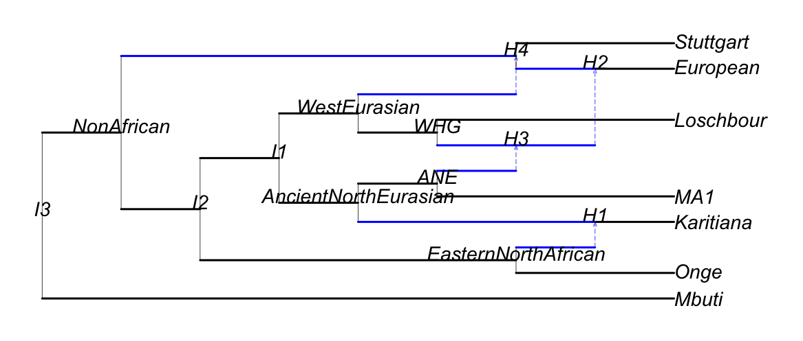

```@meta
CurrentModule = PhyloGaussianBeliefProp
```

# Getting started
This version of the package is a proof of concept, and not all methods have been
fully implemented.

A minimal API is still incomplete, and so we demonstrate the package's various
capabilities as pipelines involving multiple internal functions. A complete API
that wraps these pipelines will be made available later.

## Exact likelihood for fixed parameters

### 1\. Read in the network and the tip data
```jldoctest getting_started
julia> using PhyloGaussianBeliefProp # `test/example_networks` folder

julia> const PGBP = PhyloGaussianBeliefProp;

julia> using PhyloNetworks # `readTopology`, `tipLabels`, `preorder!`

julia> using DataFrames # `DataFrame`

julia> net = readTopology(pkgdir(PGBP, "test/example_networks", "lazaridis_2014.phy"))
PhyloNetworks.HybridNetwork, Rooted Network
23 edges
20 nodes: 7 tips, 4 hybrid nodes, 9 internal tree nodes.
tip labels: Mbuti, Onge, Karitiana, MA1, ...
(Mbuti:1.0,(((Onge:1.0,#H1:0.01::0.4)EasternNorthAfrican:1.0,(((Karitiana:1.0)#H1:0.01::0.6,(MA1:1.0,#H3:0.01::0.4)ANE:1.0)AncientNorthEurasian:1.0,(((#H2:0.01::0.4)#H3:0.01::0.6,Loschbour:1.0)WHG:1.0,#H4:0.01::0.4)WestEurasian:1.0)I1:1.0)I2:1.0,((European:1.0)#H2:0.01::0.6,Stuttgart:1.0)#H4:0.01::0.6)NonAfrican:1.0)I3;
julia> preorder!(net) # updates net.nodes_changed to contain network nodes listed in preorder

julia> df = DataFrame(taxon=tipLabels(net),
               x=[1.343, 0.841, -0.623, -1.483, 0.456, -0.081, 1.311])
7×2 DataFrame
 Row │ taxon      x       
     │ String     Float64 
─────┼────────────────────
   1 │ Mbuti        1.343
   2 │ Onge         0.841
   3 │ Karitiana   -0.623
   4 │ MA1         -1.483
   5 │ Loschbour    0.456
   6 │ European    -0.081
   7 │ Stuttgart    1.311
```
In this example, the trait `x` observed for the tip species is univariate.
We have mapped the observed data to the corresponding species in the dataframe `df`.

The call to `preorder!` updates `net` to contain a list of its nodes arranged in
preorder. Many internals in the package assume that this information is available,
and so it is important that this be called immediately after reading in the network!

`net`, which reproduces
[Lazaridis et al. (2014), Figure 3](https://doi.org/10.1038/nature13673), is
displayed below:



### 2\. Choose an evolutionary model
Models available are: [`UnivariateBrownianMotion`](@ref), [`UnivariateOrnsteinUhlenbeck`](@ref),
[`MvDiagBrownianMotion`](@ref), [`MvFullBrownianMotion`](@ref).

Note however that not all methods may be implemented across all models.

```jldoctest getting_started
julia> m = PGBP.UnivariateBrownianMotion(1, 0) # σ2 = 1.0, μ = 0.0
Univariate Brownian motion

- evolutionary variance rate σ2 :
1.0
- root mean μ :
0.0
```
We specify a univariate Brownian motion with mean ``\mu=0`` and variance rate
``\sigma^2=1``. We want to compute the likelihood for these particular values,
though other values may better fit the data.

### 3\. Build a cluster graph from the network
Methods available are: [`Bethe`](@ref), [`LTRIP`](@ref),
[`JoinGraphStructuring`](@ref), [`Cliquetree`](@ref)

```jldoctest getting_started
julia> ct = PGBP.clustergraph!(net, PGBP.Cliquetree())
Meta graph based on a Graphs.SimpleGraphs.SimpleGraph{Int8} with vertex labels of type Symbol, vertex metadata of type Tuple{Vector{Symbol}, Vector{Int8}}, edge metadata of type Vector{Int8}, graph metadata given by :cliquetree, and default weight 0

julia> PGBP.labels(ct) |> collect # cluster labels
17-element Vector{Symbol}:
 :H1EasternNorthAfricanAncientNorthEurasian
 :EasternNorthAfricanAncientNorthEurasianI2
 :OngeEasternNorthAfrican
 :StuttgartH4
 :MbutiI3
 :H2H3H4
 :H3ANEWHGH4
 :ANEWHGH4WestEurasian
 :LoschbourWHG
 :KaritianaH1
 :EuropeanH2
 :AncientNorthEurasianWestEurasianI1NonAfrican
 :ANEH4WestEurasianNonAfrican
 :ANEAncientNorthEurasianWestEurasianNonAfrican
 :AncientNorthEurasianI1I2NonAfrican
 :NonAfricanI3
 :MA1ANE
```
We choose `Cliquetree` to compute the likelihood exactly. Other methods may
return a loopy cluster graph, which gives an approximate likelihood.

See that each cluster's label is derived by concatenating the labels of the
nodes it contains.

### 4\. Initialize cluster graph beliefs
`ct` describes the topology of our cluster graph, but does not track the beliefs
for each cluster. Next, we:
- allocate memory for these beliefs
- initialize their values using the evolutionary model
- wrap them within another data structure to facilitate message passing.

```jldoctest getting_started
julia> using Tables # `columntable`

julia> tbl_x = columntable(select(df, :x)) # extract trait `x` from `df` as a column table
(x = [1.343, 0.841, -0.623, -1.483, 0.456, -0.081, 1.311],)

julia> b = PGBP.init_beliefs_allocate(tbl_x, df.taxon, net, ct, m); # allocate memory for beliefs

julia> length(b) # no. of beliefs
33

julia> b[1] # belief for cluster {H1, EasternNorthAfrican, AncientNorthEurasian} before factor assignment
belief for Cluster H1EasternNorthAfricanAncientNorthEurasian, 1 traits × 3 nodes, dimension 3.
Node labels: Int8[17, 16, 10]
trait × node matrix of non-degenerate beliefs:
Bool[1 1 1]
exponential quadratic belief, parametrized by
μ: [0.0, 0.0, 0.0]
h: [0.0, 0.0, 0.0]
J: [0.0 0.0 0.0; 0.0 0.0 0.0; 0.0 0.0 0.0]
g: 0.0

julia> PGBP.init_beliefs_assignfactors!(b, m, tbl_x, df.taxon, net.nodes_changed); # initialize beliefs from evolutionary model

julia> b[1] # belief for cluster {H1, EasternNorthAfrican, AncientNorthEurasian} after factor assignment
belief for Cluster H1EasternNorthAfricanAncientNorthEurasian, 1 traits × 3 nodes, dimension 3.
Node labels: Int8[17, 16, 10]
trait × node matrix of non-degenerate beliefs:
Bool[1 1 1]
exponential quadratic belief, parametrized by
μ: [0.0, 0.0, 0.0]
h: [0.0, 0.0, 0.0]
J: [192.30769230769232 -76.92307692307693 -115.38461538461539; -76.92307692307693 30.769230769230774 46.15384615384616; -115.38461538461539 46.15384615384616 69.23076923076923]
g: 1.7106097934927051

julia> ctb = PGBP.ClusterGraphBelief(b); # wrap beliefs to facilitate message passing

julia> PGBP.nclusters(ctb) # no. of cluster beliefs
17

julia> PGBP.nsepsets(ctb) # no. of edge/sepset beliefs
16
```
`b` is a vector of all beliefs, one for each cluster and edge (also known as
*sepset*) in the cluster graph. The edge beliefs store the most recent messages
passed between neighboring clusters.

Recall that each cluster or edge is associated with a set of nodes. The *scope*
``x`` of its belief comes from stacking the trait vectors for these nodes.
A belief with scope ``x`` is parametrized by ``(\bm{J},h,g)`` as follows:
```math
\exp(-x^{\top}\bm{J}x/2 + h^{\top}x + g)
```

We show belief `b[1]` before and after factor (i.e. conditional distribution)
assignment. Note that its `J` and `g` parameters are changed.

`ctb` contains `b` with added information to locate specific beliefs in `b` from
their corresponding cluster/edge labels in `ct`, and added storage to log
information during message passing.

### 5\. Propose a schedule from the cluster graph
A message schedule can be described by a sequence of cluster pairs.
Each pairing tells us to send a message between these clusters (which must be
neighbors), while the order within the pair indicates the sender and the
recipient.

We build a message schedule `sched` from `ct` by finding a minimal set of
spanning trees for the cluster graph that together cover all its edges (i.e.
neighbor cluster pairs). Each spanning tree is represented as a sequence of
edges following some preorder traversal of `ct`.

Since `ct` is a clique tree, there is a single spanning tree (`sched[1]`). We
extract and display the preorder sequence of edges from `sched[1]`. For example,
`NonAfricanI3` is the root cluster of `ct`, and `KaritianaH1` is a leaf cluster.

```jldoctest getting_started
julia> sched = PGBP.spanningtrees_clusterlist(ct, net.nodes_changed);

julia> DataFrame(parent=sched[1][1], child=sched[1][2]) # edges of spanning tree in preorder
16×2 DataFrame
 Row │ parent                             child                             
     │ Symbol                             Symbol                            
─────┼──────────────────────────────────────────────────────────────────────
   1 │ NonAfricanI3                       AncientNorthEurasianWestEurasian…
   2 │ AncientNorthEurasianWestEurasian…  ANEAncientNorthEurasianWestEuras…
   3 │ ANEAncientNorthEurasianWestEuras…  ANEH4WestEurasianNonAfrican
   4 │ ANEH4WestEurasianNonAfrican        ANEWHGH4WestEurasian
   5 │ ANEWHGH4WestEurasian               H3ANEWHGH4
   6 │ H3ANEWHGH4                         LoschbourWHG
   7 │ H3ANEWHGH4                         MA1ANE
   8 │ NonAfricanI3                       MbutiI3
   9 │ H3ANEWHGH4                         H2H3H4
  10 │ H2H3H4                             EuropeanH2
  11 │ H2H3H4                             StuttgartH4
  12 │ AncientNorthEurasianWestEurasian…  AncientNorthEurasianI1I2NonAfric…
  13 │ AncientNorthEurasianI1I2NonAfric…  EasternNorthAfricanAncientNorthE…
  14 │ EasternNorthAfricanAncientNorthE…  H1EasternNorthAfricanAncientNort…
  15 │ H1EasternNorthAfricanAncientNort…  OngeEasternNorthAfrican
  16 │ H1EasternNorthAfricanAncientNort…  KaritianaH1
```

### 6\. Calibrate beliefs with the schedule
We apply one iteration of belief propagation on `ctb` following the schedule
`sched`. Since `ct` is a clique tree, the resulting beliefs are guaranteed to be
*calibrated* (i.e. the beliefs of neighbor clusters agree marginally over the
sepset between them).

```jldoctest getting_started
julia> PGBP.calibrate!(ctb, sched);
```

### 7\. Extract the log-likelihood
On a calibrated clique tree, there are two ways to obtain the log-likelihood:
- integrate any belief over its scope to get its normalization constant (`norm`)
- compute the [`factored_energy`](@ref), which approximates the log-likelihood on loopy cluster graphs but is exact on a clique tree

```jldoctest getting_started
julia> (_, norm) = PGBP.integratebelief!(b[1]); # `norm` is the integral of `b[1]` over its scope

julia> norm
-11.273958980921249

julia> (_, _, fe) = PGBP.factored_energy(ctb); # `fe` is the factored energy from the cluster/edge beliefs

julia> fe
-11.273958980921272
```
The first approach is more efficient (it uses only one belief, rather than all
beliefs), but only works for a clique tree. The normalization constant of a
belief from a calibrated loopy cluster graph cannot be similarly interpreted.

We see that both approaches return the same value, modulo rounding error.

## Exact inference
In the section above, we computed the log-likelihood for ``\mu=0``, ``\sigma^2=1``.

Now we find ``\mu=\widehat{\mu}`` and ``\sigma^2=\widehat{\sigma}^2`` that
maximize the log-likelihood. There are two options:
- iterative optimization
- exact computation using belief propagation

```jldoctest getting_started
julia> mod, ll, _ = PGBP.calibrate_optimize_cliquetree!( # iterative optimization
               ctb, # beliefs
               ct, # clique tree
               net.nodes_changed, # network nodes in preorder
               tbl_x, # trait data
               df.taxon, # tip labels
               PGBP.UnivariateBrownianMotion, # type of evolutionary model
               (1.0, 0)); # starting parameters: σ2 = 1.0, μ = 0.0

julia> mod # ML estimates
Univariate Brownian motion

- evolutionary variance rate σ2 :
0.31812948857664464
- root mean μ :
1.1525789703803826

julia> ll # log-likelihood for ML estimates
-8.656529929205773

julia> mod, _ = PGBP.calibrate_exact_cliquetree!( # exact computation
               ctb,
               sched[1], # spanning tree
               net.nodes_changed,
               tbl_x,
               df.taxon,
               PGBP.UnivariateBrownianMotion);

julia> mod # REML estimate for σ2, ML estimate for μ
Univariate Brownian motion

- evolutionary variance rate σ2 :
0.37115107002903314
- root mean μ :
1.1525789703844822
```
Both options return the maximum-likelihood (ML) estimate for ``\mu``, though
the latter returns the restricted maximum-likelihood (REML) estimate for
``\sigma^2``.

Strictly speaking, the estimates from the latter option do not jointly maximize
the log-likelihood. However, the REML estimate for ``\sigma^2`` is generally
less biased than its ML counterpart.

## Approximate inference
Suppose now that we use a loopy cluster graph instead. We choose `Bethe` to
construct a Bethe cluster graph (also known as factor graph) `fg`.

As before, we set up a data structure `fgb` to track the beliefs of the factor
graph during message passing. Then we call [`calibrate_optimize_clustergraph!`](@ref),
the analog of [`calibrate_optimize_cliquetree!`](@ref) from earlier:

```jldoctest getting_started
julia> fg = PGBP.clustergraph!(net, PGBP.Bethe()) # factor graph
Meta graph based on a Graphs.SimpleGraphs.SimpleGraph{Int8} with vertex labels of type Symbol, vertex metadata of type Tuple{Vector{Symbol}, Vector{Int8}}, edge metadata of type Vector{Int8}, graph metadata given by :Bethe, and default weight 0

julia> b_fg = PGBP.init_beliefs_allocate(tbl_x, df.taxon, net, fg, m); # allocate memory for beliefs

julia> fgb = PGBP.ClusterGraphBelief(b_fg); # wrap beliefs to facilitate message passing

julia> mod, fe, _ = PGBP.calibrate_optimize_clustergraph!(fgb, fg, net.nodes_changed, tbl_x,
               df.taxon, PGBP.UnivariateBrownianMotion, (1.0, 0));

julia> mod # parameter estimates
Univariate Brownian motion

- evolutionary variance rate σ2 :
0.3181295330492941
- root mean μ :
1.1525789120595669

julia> fe # factored energy approximation to the log-likelihood
-8.587925093657454
```
We see that both parameter estimates are very close to their maximum-likelihood
counterparts (within 10⁻⁴ percent), and the factored energy slightly
overestimates the log-likelihood for these values (within 1 percent).
